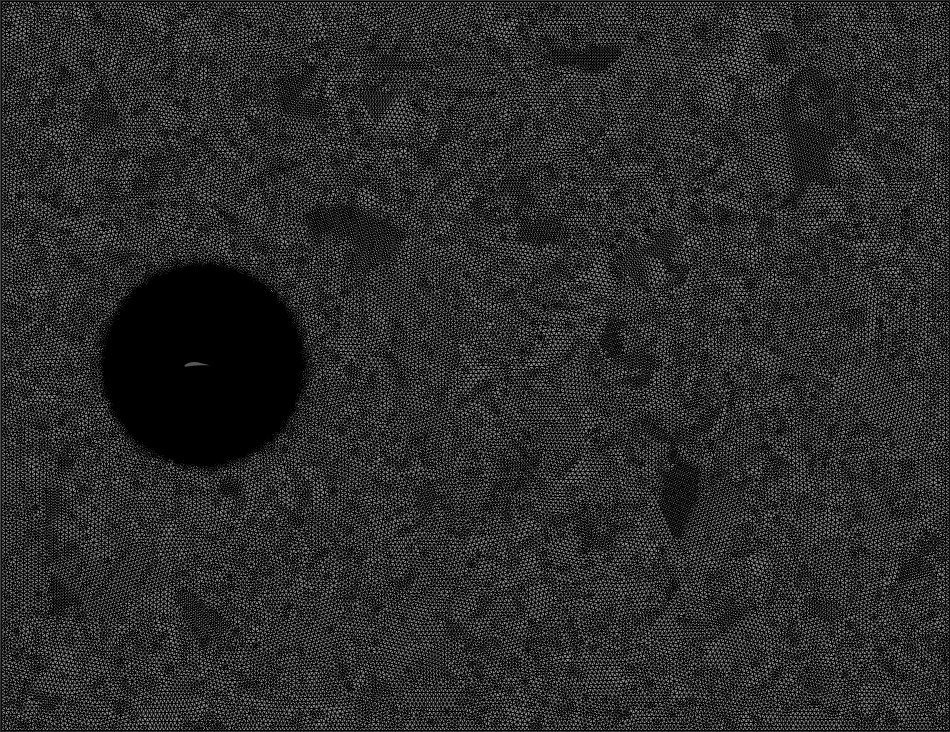
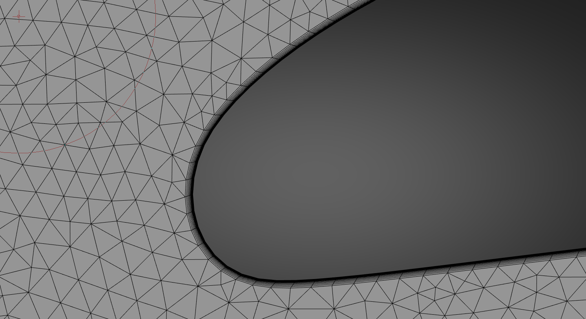
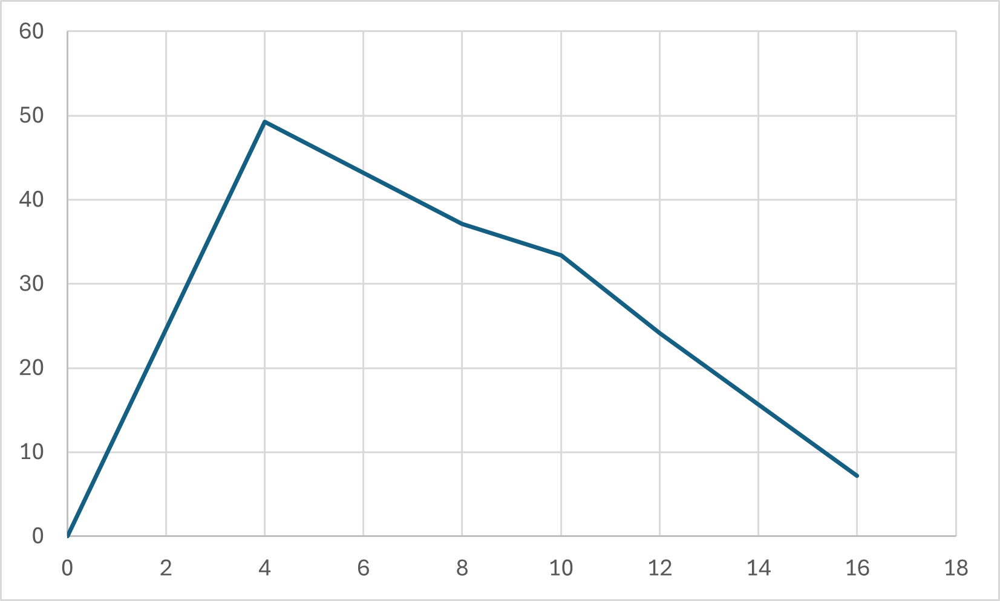
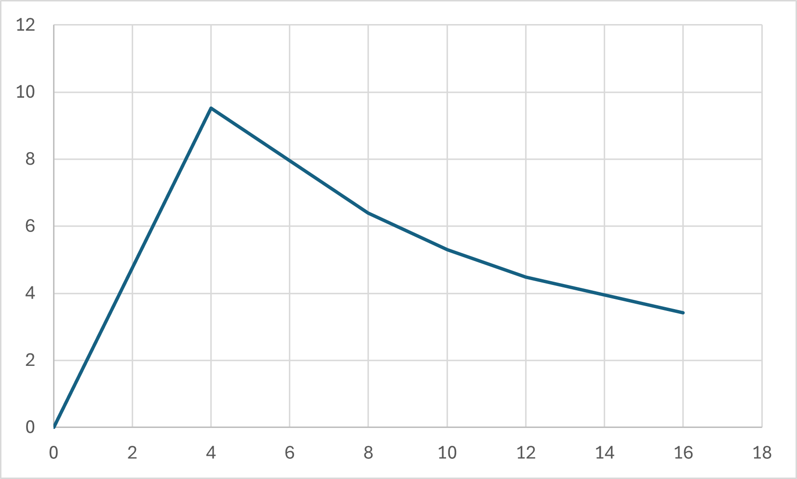
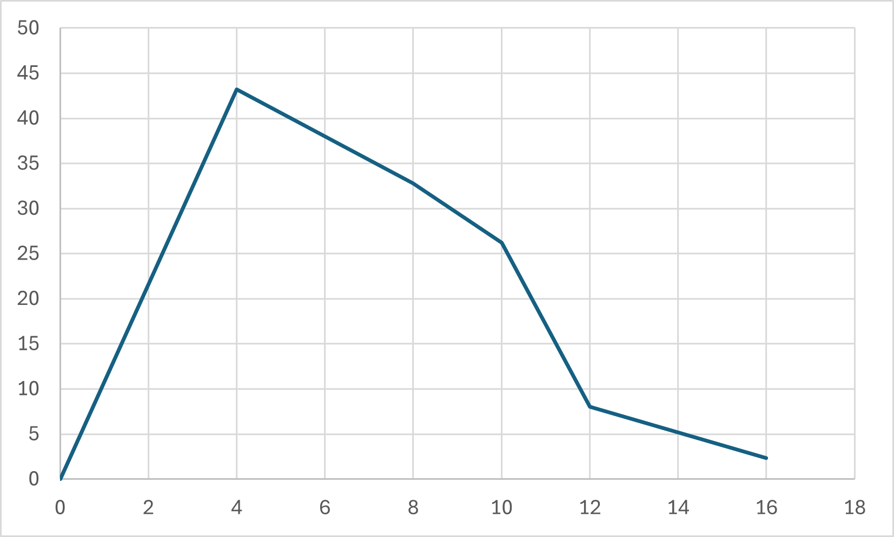

# Project Overview
Three airfoil geometries(NACA 4412, LNV109A, NACA 2410) which were selected on the basis of ease of maufacturing were selected as potential candidates of 2D sections of the rear wing of a FS vehicle and numerical analysis was coducted and compared in high-fidelity and low-fidelity simulations using ANSYS and Xflr5 respectively to determine the one with optimal lift and drag performance at an Angle of Attack range of 0 to 15 degrees. The flow conditions were taken to be 80 kmph and characteristic length = 1m. 

This project is hosted at [https://github.com/SatvikS3638/Aerowing]

# Numerical Setup
## ANSYS Fluent
Fluent was used as the ANSYS tool for the CFD analysis. The Re = 1564574 was calculated from the given flow conditions and inlet was adust accordingly for airfoil chord length. The y+ value for grid spacing near the wall of the C-mesh domain was calculated from the tool provided by [https://www.cadence.com/en_US/home/tools/system-analysis/computational-fluid-dynamics/y-plus.html]. A circular region of finer mesh was introduced around the airfoil to further improve the results. The turulence model used was viscous k-omega SST.

## XFLR5
The Re based flow conditions and airfoil geometry were provided to the tool which extracted the required plots of Cl and Cd vs angle of attack. This tool was employed to get easily computable low fidelity results for comparison with the high fidelity ones to ensure general semblance of both. 

# Results
All the three airfoils generated increasing lift and drag with increasing angle of attack. Although the LNV109A airfoil generated the highest magnitude of lift, the drag magnitude was also high. The NACA 4412 airfoil gave the most optimal results with sufficiently high lift and minmal drag at the same time. This geometry can be used for the intended purpose. The lift-to-drag ratio plots revealed that aerodynamic performance initially increases for all three geometries up to around 8 degrees angle of attack, and decreases susequently. This might be attributed to stalling phenomenon. 

